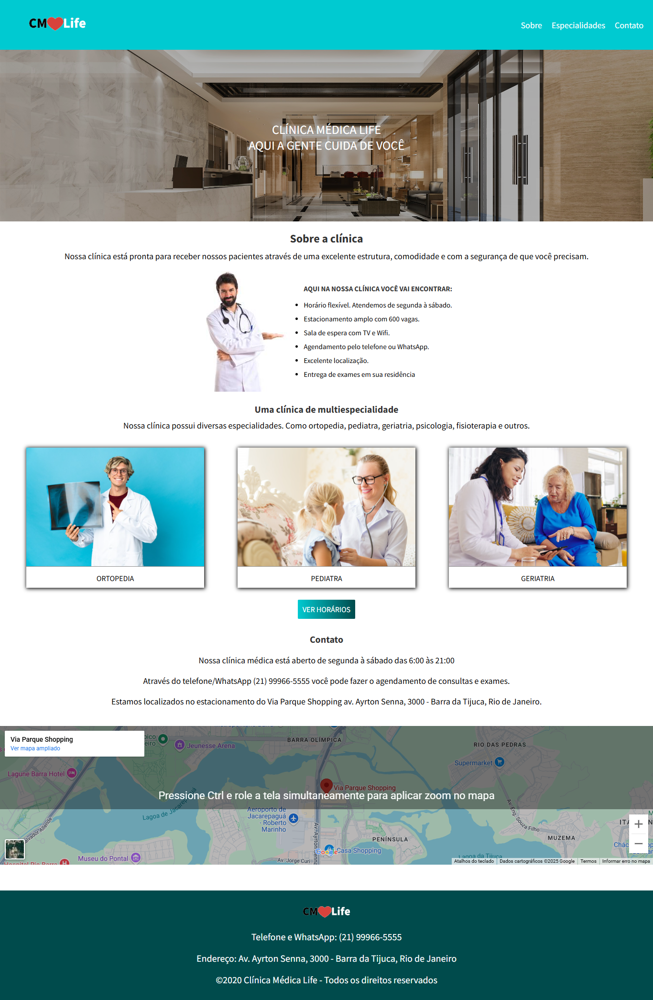
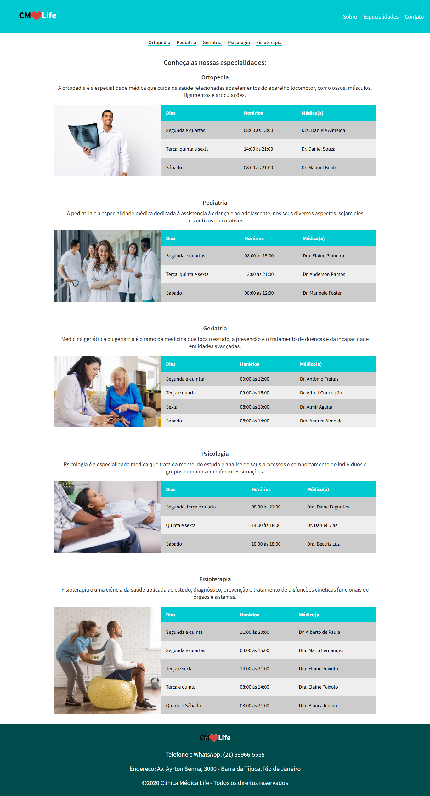
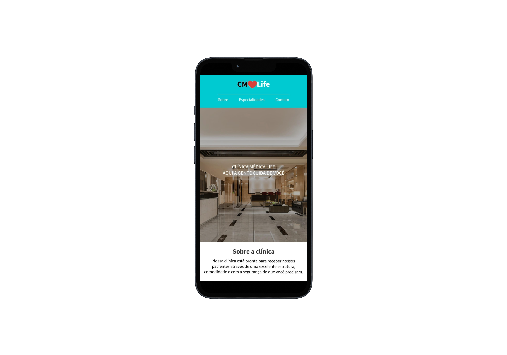

# CM❤️Life - Clínica Médica

Este site foi desenvolvido como parte de uma atividade prática do curso de Front End oferecido pela DevMedia.

O objetivo foi aplicar conhecimentos de HTML e CSS responsivo na criação de um site institucional.

Essa é uma Landing page fictícia baseada em uma clínica médica, com foco na apresentação dos serviços, especialidades e contato.

## 🩺 Sobre o projeto

O site apresenta a **Clínica Médica Life**, oferecendo uma navegação simples e responsiva, com foco na experiência do paciente.

## Preview

### Tela Desktop

### Tela Mobile

## 🛠 Tecnologias usadas

- HTML5
- CSS3
- Layout responsivo

## 📑 Funcionalidades

- Página inicial com chamada principal e imagem de fundo
- Sessão "Sobre a clínica"
- Página específica para as especialidades médicas
- Contato e navegação entre seções
- Localização da clínica

## 🚀 Como executar

Você pode abrir o arquivo `index.html` diretamente no seu navegador, ou acessar a versão online do site:

🔗 [Acesse aqui a versão publicada](https://web-site-hospital.vercel.app/)

## Licença

Este projeto está sob a licença MIT. Para mais detalhes, consulte o arquivo [LICENSE](LICENSE).
